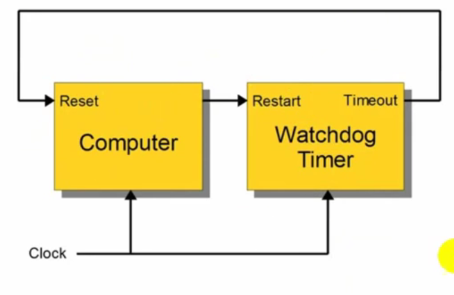

# WATCHDOG TIMER TRONG FREERTOS

## Tổng quan

- Cũng là 1 loại Timer

- Là Timer đặc biệt có chức năng kiểm soát chống treo chương trình



- Watchdog Timer sẽ không bị treo khi vi điều khiển bị treo vì nó dùng xung Clock riêng với vi điều khiển (Clock này được cấp cho cả vi điều khiển và Watchdog Timer).

Tóm lại: Watchdog Timer (WDT) là cơ chế phần cứng hoặc phần mềm để phục hồi hệ thống khi chương trình bị treo/đóng băng. Nếu hệ thống không “cơ cấu” (feed/kick/refresh) WDT trong khoảng thời gian kỳ vọng thì WDT gây reset hệ thống (hoặc tạo interrupt) — giúp đưa MCU về trạng thái xác định thay vì treo vô hạn.

### Tại sao cần WDT trong hệ thống có FreeRTOS

- FreeRTOS quản lý nhiều task song song, nếu một task then chốt deadlock, block vô hạn, hoặc toàn hệ thống gặp livelock thì WDT sẽ reset hệ thống thay vì để treo.

- WDT là lớp bảo vệ cuối cùng (last-resort) cho reliability (safety/availability) trong embedded.

### Các loại Watchdog (chung)

- Hardware Independent Watchdog (IWDG) — watchdog độc lập, chạy từ nguồn/clock riêng (không bị halt khi CPU stop).

- Window Watchdog (WWDG) — chỉ chấp nhận refresh trong một “cửa sổ” thời gian; refresh sớm/ muộn đều gây lỗi (phát hiện bug refresh sớm).

- Software Watchdog — timer do phần mềm kiểm tra, dễ cho debugging nhưng bị mất nếu CPU freeze.

### Nguyên tắc tích hợp WDT với FreeRTOS

Các pattern phổ biến:

#### Feed bởi một Supervisor Task (recommended)

- Mọi task quan trọng phải gửi “heartbeat” (notification/queue/increment counter) tới một task giám sát (watchdog manager).

- Supervisor kiểm tra các heartbeat theo chu kỳ; nếu mọi thứ OK -> supervisor feed hardware WDT; nếu task nào chết -> không feed -> WDT reset.

- Lợi: bạn biết task nào chết, có thể ghi log trước khi reset.

#### Feed trực tiếp từ một task riêng

- Đơn giản: task duy nhất phụ trách feed. Rủi ro nếu task này chết thì hệ thống reset (điều này có thể chấp nhận nếu task đó phải sống).

#### Feed từ Idle Hook (vApplicationIdleHook)

- Cẩn trọng: Idle có thể không chạy nếu CPU bị bận bởi high-priority task blocking other tasks — có thể che dấu deadlock. Không khuyến khích trừ phi bạn hiểu rõ.

#### Task-level WDT (per-task watchdog)

- Mỗi task có timer nội bộ; nếu một task bị treo thì supervisor phát hiện, reset hoặc restart các tài nguyên.

#### Feed từ ISR

- Thường không nên feed WDT từ ISR trừ khi ISR chứng minh mọi thứ khỏe mạnh (ISR chạy ngay cả khi scheduler deadlock?). ISR feed có thể che dấu deadlock ở mức task.

### Cách thiết kế “Supervisor + Heartbeat” (mẫu khuyến nghị)

Ý tưởng:

- `N` task quan trọng. Mỗi task có ID `i`. Mỗi task gửi heartbeat định kỳ (ví dụ: xTaskNotifyGive(supervisorHandle) kèm id, hoặc set 1 bit vào event-group).

- Supervisor wake-up mỗi `CHECK_PERIOD`. Với mỗi task: nếu không thấy heartbeat trong vòng `MAX_MISSES` → báo lỗi (log, dump), có thể không feed WDT để hệ thống reset hoặc thực hiện recovery. Nếu tất cả OK → feed hardware watchdog.

### Thời gian timeout WDT — cách tính & lưu ý

- Chọn timeout > worst-case blocking time + margin. Tức là: tính tổng thời gian chậm nhất mà task hoặc hệ có thể bị chặn hợp lệ (block trên I/O, deep sleep, OTA update, garbage collection, etc.) rồi thêm hệ số an toàn (20–50%).

- Nếu timeout quá ngắn → false positive reset. Quá dài → mất lợi ích bảo vệ.

- Khi hệ multi-core (ESP32): cân nhắc watchdog trên từng core hoặc sử dụng watchdog riêng cho core chịu trách nhiệm system health.

### Window Watchdog (WWDG) — khi dùng

- WWDG phát hiện cả refresh quá sớm và quá muộn — hữu ích khi bug làm vòng lặp feed liên tục (náu lỗi).

- Nếu dùng WWDG phải thiết kế thời gian cửa sổ đúng: không feed trước thời điểm window opens.

### Những lỗi/thói quen sai phổ biến (pitfalls)

- Feed WDT ở quá nhiều nơi → khó debug (khó biết phần nào feed). Nên tập trung feed ở 1 nơi (supervisor).

- Feed từ ISR khiến deadlock ở mức task không bị reset.

- Đặt timeout quá ngắn gây reset giả.

- Dùng Idle hook để feed: có thể che dấu deadlock ở mức priority cao.

- Không log nguyên nhân trước khi reset → mất thông tin triage. Tốt nhất có cơ chế dump logs trước reset (ví dụ enable WDT warning interrupt, hoặc ghi vào RTC RAM/backup register).

- Không kiểm tra reset reason sau khởi động (bạn nên đọc flag reset reason để phân tích sau reset).

### Lưu ý khi dùng WDT với chế độ low-power / sleep

- Nếu MCU đi vào deep-sleep, WDT có thể vẫn chạy (tùy phần cứng) → cần disable hoặc cấp nguồn watchdog phù hợp trước khi sleep, hoặc feed trước khi sleep và kéo dài timeout.

### Cách lấy thông tin sau WDT reset (debug)

- Trước reset: nếu phần cứng hỗ trợ, cấu hình WDT early warning interrupt để log trạng thái (task list, stack high water mark, last heartbeat, fault registers).

- Sau reset: đọc Reset Reason Register, đọc RTC backup memory để xem last error, bật coredump hoặc store last crash info vào NVRAM/flash.

- Bật các hook trong FreeRTOS: `vApplicationStackOverflowHook`, `vApplicationMallocFailedHook` để log/mark trước khi hệ bị reset.

### Ví dụ API cụ thể (thực tế)

ESP-IDF/Arduino in PlatformIO:

🧩 1️⃣ esp_task_wdt_init(timeout_seconds, panic)

Mục đích: Khởi tạo và cấu hình bộ giám sát Watchdog cho toàn hệ thống FreeRTOS.

Hiểu là bật WDT của task lên để bắt đầu đếm, quản lý timeout cho task để tránh task bị treo

📘 Cú pháp:

```c
esp_err_t esp_task_wdt_init(uint32_t timeout_seconds, bool panic);
```

📗 Tham số:

| Tham số           | Kiểu       | Giải thích                                                                                                                  |
| ----------------- | ---------- | --------------------------------------------------------------------------------------------------------------------------- |
| `timeout_seconds` | `uint32_t` | Thời gian tối đa (tính bằng giây) mà một task được đăng ký có thể **không reset** WDT trước khi bị coi là treo              |
| `panic`           | `bool`     | Nếu `true`: hệ thống sẽ **in ra backtrace** và **reset ESP32** khi WDT timeout. Nếu `false`: chỉ log cảnh báo, không reset. |

📗 Giá trị trả về:

- `ESP_OK` → thành công

- `ESP_ERR_INVALID_STATE` → WDT đã được khởi tạo trước đó

- `ESP_ERR_NO_MEM` → không đủ bộ nhớ để khởi tạo WDT

💡 Ví dụ:

```c
esp_task_wdt_init(5, true); // khởi tạo WDT với timeout = 5s, tự reset ESP32 khi task treo
```

🧠 Sau lệnh này, Task WDT service được tạo bên trong FreeRTOS, nhưng chưa có task nào được giám sát cả.

Phải gọi `esp_task_wdt_add()` tiếp theo để thêm task vào danh sách theo dõi.

🧩 2️⃣ esp_task_wdt_add(taskHandle)

Mục đích: Đăng ký 1 task cụ thể vào danh sách giám sát của WDT.

Hiểu là để giám sát task thì cần phải đăng ký với FreeRTOS để nó biết task nào cần giám sát WDT

📘 Cú pháp:

```c
esp_err_t esp_task_wdt_add(TaskHandle_t taskHandle);
```

📗 Tham số:

| Tham số      | Giải thích                                                                                                         |
| ------------ | ------------------------------------------------------------------------------------------------------------------ |
| `taskHandle` | con trỏ `TaskHandle_t` của task cần giám sát. Nếu truyền `NULL` → nghĩa là **task hiện tại** (đang chạy lệnh này). |

📗 Giá trị trả về:

- `ESP_OK` → đăng ký thành công

- `ESP_ERR_INVALID_ARG` → task handle không hợp lệ

- `ESP_ERR_NOT_FOUND` → Task WDT chưa được khởi tạo bằng `esp_task_wdt_init()`

- `ESP_ERR_INVALID_STATE` → task đã được đăng ký trước đó

💡 Ví dụ:

```c
esp_task_wdt_add(NULL); // đăng ký task hiện tại
```

🔎 Khi task đã được add, bộ giám sát WDT sẽ bắt đầu theo dõi task đó.

Nếu task không gọi `esp_task_wdt_reset()` trong khoảng `timeout_seconds` → WDT trigger.

🧩 3️⃣ esp_task_wdt_reset()

Mục đích: Reset bộ đếm Watchdog cho task hiện tại, `báo rằng task này vẫn đang “sống”`.

Hiểu là tắt WDT cho task này để nó reset đếm lại

📘 Cú pháp:

```c
esp_err_t esp_task_wdt_reset();
```

📗 Giá trị trả về:

- `ESP_OK` → reset thành công

- `ESP_ERR_NOT_FOUND` → task hiện tại chưa được đăng ký trong WDT

- `ESP_ERR_INVALID_STATE` → WDT chưa được khởi tạo

💡 Ví dụ:

```c
esp_task_wdt_reset(); // reset lại bộ đếm WDT cho task hiện tại
```

⚙️ Khi gọi hàm này, bộ đếm thời gian (timer) của task được đặt lại về 0 và bắt đầu đếm lại từ đầu.
Nếu không gọi trong thời gian quy định → ESP32 reset.

🧩 4️⃣ esp_task_wdt_delete(taskHandle)

Mục đích: Gỡ bỏ 1 task khỏi danh sách giám sát của WDT.

📘 Cú pháp:

```c
esp_err_t esp_task_wdt_delete(TaskHandle_t taskHandle);
```

📗 Tham số:

| Tham số      | Giải thích                                                        |
| ------------ | ----------------------------------------------------------------- |
| `taskHandle` | con trỏ tới task cần gỡ bỏ. Nếu `NULL` → gỡ bỏ **task hiện tại**. |

📗 Giá trị trả về:

- `ESP_OK` → xóa thành công

- `ESP_ERR_NOT_FOUND` → task chưa được đăng ký hoặc WDT chưa khởi tạo

- `ESP_ERR_INVALID_STATE` → WDT không hoạt động

💡 Ví dụ:

```c
esp_task_wdt_delete(NULL); // bỏ giám sát task hiện tại
```

🧩 Dùng khi task sắp kết thúc, hoặc không muốn giám sát task này nữa.

## Quy trình gọi API WDT cho task

- B1: Đặt ngưỡng timeout cho WDT

```c
#define WDT_TIMEOUT timeSecond // timeout timeSecond for WDT
```

- B2: Tạo task như bình thường

- B3: trong stage setup của task cần WDT theo dõi, đăng ký cho FreeRTOS biết task này cần được theo dõi bởi WDT

```c
// Đăng ký WDT cho task này
esp_task_wdt_add(NULL);
```

- B4: trong stage loop, tùy giải thuật của task, tư duy sao cho task không bị treo khi thời gian chạy quá timeout WDT, tại đó cần reset lại task bằng cập nhật lại WDT

```c
// Cập nhật WDT để không timeout
esp_task_wdt_reset();
```

- B5: trong void setup(), thực hiện khởi tạo WDT trong hệ thống FreeRTOS, sau các lệnh khởi tạo Serial monitor

```c
// Khởi tạo WDT toàn hệ thống, timeout 2 giây
esp_task_wdt_init(WDT_TIMEOUT, true);
```

Như thế là đã hoàn thành việc quản lý task bằng WDT
