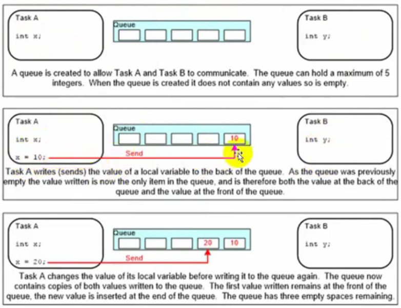
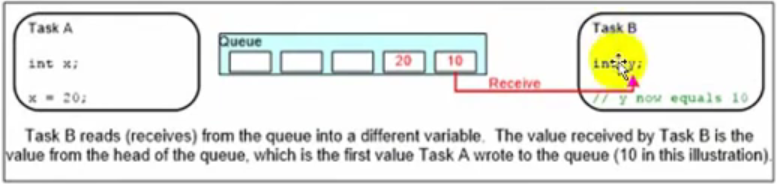
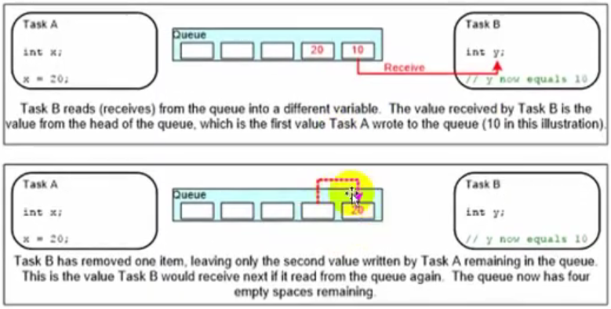

# QUEUE TRONG FREERTOS

Sau khi tạo ra các task trong FreeRTOS, các task này không thể giao tiếp trực tiếp với nhau được.

Để các task có thể giao tiếp với nhau, ta cần 1 cấu trúc xử lý hàng đợi Queue trong FreeRTOS

## Queue - Hàng đợi

- Là cấu trúc dữ liệu có thể chứa được số lượng hữu hạn các phần tử có kích thước cố định, và vận hành theo cơ chế `FIFO`.

- Hàng đợi cung cấp cơ chế giao tiếp giữa các task, giữa task với ngắt, giữa ngắt với task.

- Thường dùng để truyền dữ liệu giữa các task

- Quy trình minh họa Queue







## Quy trình làm việc

### Include library

Thư viện làm việc với FreeRTOS:

```c
#include "freertos/FreeRTOS.h"
#include "freertos/task.h"
```

Thư viện làm việc với Queue:

```c
#include "freertos/queue.h"
```

### Tạo 1 Queue để chứa các items, phục vụ truyền/nhận dữ liệu

Các message là thứ được gửi đi, xếp vào trong Queue, các message này còn được gọi là items

Khởi tạo 1 đối tượng Queue để lưu các items thông qua handle cho Queue:

```c
QueueHandle_t xQueue;   // handle cho hàng đợi
```

API tạo Queue:

```c
xQueueCreate(UBaseType_t uxQueueLength, UBaseType_t uxItemSize);
```

Trong đó:

- `uxQueueLength` : độ dài hàng đợi - số lượng items tối đa có thể có.

- `uxItemSize` : kích thước của 1 items đặt vào hàng đợi

### Truyền dữ liệu từ Queue

Dùng để cần truyền dữ liệu từ task vào Queue để lưu các items data vào trong Queue

#### API truyền dữ liệu từ Queue chuẩn

```c
BaseType_t xQueueSend(
    QueueHandle_t xQueue,
    const void *pvItemToQueue,
    TickType_t xTicksToWait
);
```

Trong đó:

- `xQueue` → handle của queue đã được tạo bằng `xQueueCreate()`.

- `pvItemToQueue` → con trỏ trỏ tới dữ liệu muốn gửi (ví dụ &myStruct hoặc &myValue).

- `xTicksToWait` → số tick tối đa để chờ nếu queue đang đầy.

    `0` → không chờ (non-blocking).

    `portMAX_DELAY` → chờ vô hạn (nếu configINCLUDE_vTaskSuspend = 1).

Trả về:

- `pdPASS` → gửi thành công.

- `errQUEUE_FULL` → thất bại (queue đầy và hết thời gian chờ).

Ví dụ:

```c
xQueueSend(xQueue, &value, pdMS_TO_TICKS(100));
```

#### API truyền dữ liệu từ Queue trong ISR

```c
BaseType_t xQueueSendFromISR(
    QueueHandle_t xQueue,
    const void * pvItemToQueue,
    BaseType_t *pxHigherPriorityTaskWoken
);
```

Giải thích:

- Dùng trong ISR (ngắt timer, UART, GPIO...).

- Không có thời gian chờ → chỉ gửi nếu còn chỗ.

- Nếu gửi thành công và task nhận có ưu tiên cao hơn, sẽ đặt `*pxHigherPriorityTaskWoken = pdTRUE`.

Sau ISR, nên gọi `portYIELD_FROM_ISR( xHigherPriorityTaskWoken );`
để scheduler chuyển ngay sang task có ưu tiên cao hơn (nếu có).

#### API truyền dữ liệu từ Queue theo cách ghi đè dữ liệu

Dùng khi queue chỉ chứa 1 phần tử (ví dụ buffer cảm biến mới nhất).

Nếu queue đang đầy → phần tử mới ghi đè lên phần tử cũ.

```c
BaseType_t xQueueOverwrite(
    QueueHandle_t xQueue,
    const void * pvItemToQueue
);
```

#### Các tình huống sử dụng API truyền phù hợp

| Tình huống                                    | API nên dùng                                     |
| --------------------------------------------- | ------------------------------------------------ |
| Gửi dữ liệu bình thường (trong task)          | `xQueueSend()` hoặc `xQueueSendToBack()`         |
| Gửi dữ liệu và ưu tiên phần tử mới nhất       | `xQueueOverwrite()`                              |
| Gửi dữ liệu từ **ngắt**                       | `xQueueSendFromISR()`                            |
| Gửi dữ liệu quan trọng nhất (đầu queue)       | `xQueueSendToFront()`                            |
| Queue chỉ 1 phần tử (ghi đè mỗi lần cập nhật) | `xQueueOverwrite()` / `xQueueOverwriteFromISR()` |

### Nhận dữ liệu vào Queue

Dùng để nhận dữ liệu từ Queue về task nào đó cần item data đã được lưu trong Queue

#### API nhận dữ liệu từ Queue chuẩn

```c
BaseType_t xQueueReceive(
    QueueHandle_t xQueue,
    void *pvBuffer,
    TickType_t xTicksToWait
);
```

Trong đó:

- `xQueue` → handle của queue đã tạo (từ `xQueueCreate()`).

- `pvBuffer` → con trỏ tới vùng nhớ để lưu dữ liệu nhận được (đủ kích thước item).

- `xTicksToWait` → thời gian chờ (nếu queue rỗng):

    `0` → không chờ (non-blocking).

    `portMAX_DELAY` → chờ vô hạn (nếu `configINCLUDE_vTaskSuspend == 1`).

Trả về

- `pdPASS` → nhận thành công.

- `errQUEUE_EMPTY` → thất bại (queue rỗng và hết thời gian chờ).

Ví dụ:

```c
xQueueReceive(xQueue, &value, pdMS_TO_TICKS(500));
```

#### Xem dữ liệu nhưng không xoá khỏi Queue

- Giống `xQueueReceive()` nhưng không xoá phần tử.

- Dữ liệu chỉ được sao chép ra `pvBuffer` để xem trước.

- Thích hợp cho việc kiểm tra trạng thái hàng đợi hoặc đọc dữ liệu cảm biến mà không tiêu thụ.

```c
BaseType_t xQueuePeek(
    QueueHandle_t xQueue,
    void *pvBuffer,
    TickType_t xTicksToWait
);
```

#### Nhận trong ngắt

- Dùng trong ngữ cảnh ISR, không blocking.

```c
BaseType_t xQueueReceiveFromISR(
    QueueHandle_t xQueue,
    void *pvBuffer,
    BaseType_t *pxHigherPriorityTaskWoken
);
```

- Nếu nhận thành công và có task chờ queue này có ưu tiên cao hơn, hàm sẽ đặt
`*pxHigherPriorityTaskWoken = pdTRUE`. Sau đó nên gọi:

```c
portYIELD_FROM_ISR(xHigherPriorityTaskWoken);
```

để nhường CPU ngay cho task cao hơn.

#### Xem dữ liệu trong ISR

- Giống `xQueuePeek()`, nhưng dùng trong ISR.

Không xoá phần tử, chỉ đọc ra để kiểm tra.

```c
BaseType_t xQueuePeekFromISR(
    QueueHandle_t xQueue,
    void * pvBuffer
);
```

#### Các tình huống sử dụng API nhận phù hợp

| Tình huống                          | API phù hợp              |
| ----------------------------------- | ------------------------ |
| Nhận dữ liệu trong task bình thường | `xQueueReceive()`        |
| Xem trước dữ liệu (không xoá)       | `xQueuePeek()`           |
| Nhận dữ liệu trong ISR              | `xQueueReceiveFromISR()` |
| Xem trước trong ISR                 | `xQueuePeekFromISR()`    |
