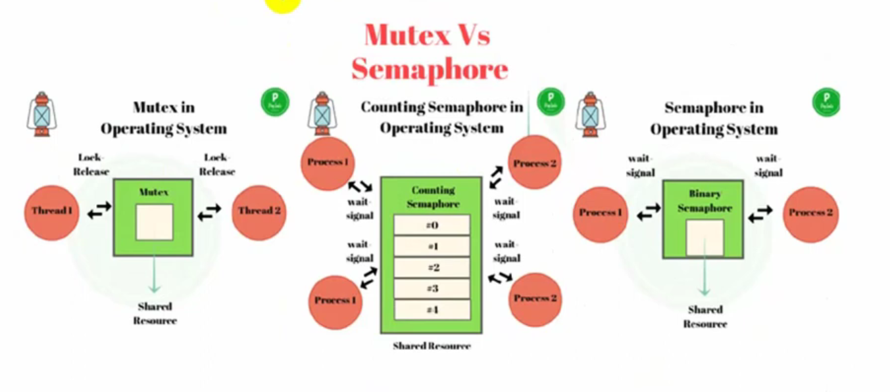

# MUTEX TRONG FREERTOS

## Mutex

Các task không thể cùng truy cập vào tài nguyên dùng chung trong FreeRTOS được.

Do đó cần dùng cơ chế Mutex để quản lý khả năng truy cập vào tài nguyên dùng chung của các task

### Mutex là gì?

Tương tự như Semaphore, Mutex cũng là 1 cơ chế để báo hiệu cho các task, nhưng không giống Semaphore có chức năng tăng/giảm, ở Mutex lầ khả năng tự động give và take. Mutex dùng để bảo vệ tài nguyên được chia sẻ.

Người ta sẽ gán thẻ Mutex cho tài nguyên. Chỉ task nào có thẻ này mới có thể truy cập tài nguyên. Vì vậy, đảm bảo 1 tài nguyên (biến) không thể bị truy cập ở 2 task cùng lúc.



#### So sánh điểm khác giữ Semaphore và Mutex

Semaphore binary:

- Có 1 cờ (flag), nếu cờ = 1: task được thực thi, cờ bằng 0: task không được thực thi.

- Khi cờ = 0: task không được thực thi, chờ cho đến khi cờ =1: thì task mới được thực thi.

- Task sẽ bị rơi vào trạng thái `suspended` và sẽ bị mất 1 khoảng thời gian chờ để cờ thay đổi 0 sang 1.

Mutex:

- Có 1 thẻ để quản lý việc thực thi, task giữ thẻ sẽ được thực thi, task không giữ thẻ sẽ không được thực thi.

- Khi task giữ thẻ được thực thi thì task không giữ thẻ sẽ không được thị thi. Lúc này task không giữ thẻ sẽ rơi vào trạng thái bị khóa `Blocked`.

- Thay vì tốn thời gian chờ thì task không giữ thẻ sẽ bị rơi vào trạng thái khóa `Blocked`. Cho đến khi thẻ được task đang thực thi thả ra và task bị khóa sẽ lấy thẻ đó thì thoát khỏi trạng thái bị khóa và tiến hành thực thi task.

### Sử dụng Mutex

#### Include thư viện

- Thư viện cho FreeRTOS

```cpp
#include "freertos/FreeRTOS.h"
#include "freertos/task.h"
```

- Thư viện cho Mutex, dùng chung thư viện với Semaphore

```cpp
#include "freertos/semphr.h"
```

#### Tạo 1 thẻ Mutex

- Tạo 1 thẻ để các task dùng chung

```cpp
SemaphoreHandle_t xMutex = NULL;
```

#### Tạo ra Mutex trong FreeRTOS

- Sau khi tạo 1 thẻ Mutex, cần nói ra cho FreeRTOS biết sẽ có Mutex trong hệ thống

```cpp
xSemaphoreCreateMutex();
```

#### Xóa Mutex trong FreeRTOS

- Khi không dùng Mutex nữa và cần giải phóng tài nguyên

```cpp
vSemaphoreDelete(SemaphoreHandle_t xMutex);
```

#### Lấy thẻ Mutex

- Lấy thẻ Mutex để task lấy quyền sử dụng Mutex

```cpp
xSemaphoreTake(SemaphoreHandle_t xMutex, TickType_t xTicksToWait);
```

- Các tham số tương tự cùng ý nghĩa như Semaphore.

#### Trả thẻ Mutex

- Trả thẻ Mutex để task trả lại quyền sử dụng Mutex

```cpp
xSemaphoreGive(SemaphoreHandle_t xMutex);
```

- Các tham số tương tự cùng ý nghĩa như Semaphore.

### Chú ý

Vì khác với Semaphore có cơ chế tăng/giảm cờ. Task muốn gửi items đi thì gọi API gửi, còn task muốn lấy items về thì gọi API nhận.

Mutex nó tự động lấy thẻ để thực hiện task và trả thẻ khi task thực hiện xong trong cùng 1 task.

-> Vì thế trong cùng 1 task, đều gọi của API lấy thẻ Mutex và API trả thẻ Mutex.

Và trong Mutex không có API xử lý ngắt
